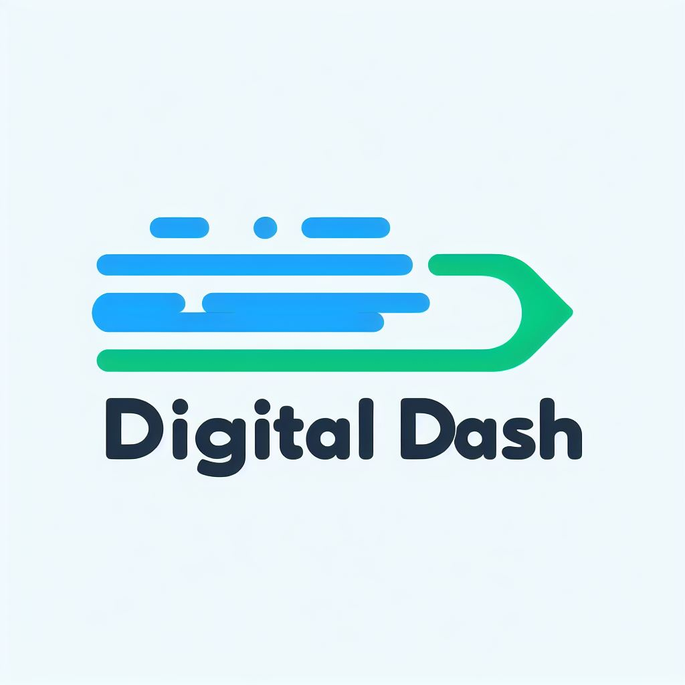

# **Digital Dash**

## **Identification**

### **Visual Identification**

- Symbol: The blue arrow represents speed, movement and progress, conveying the idea that the company is dynamic and constantly evolving.

- Name: The word "Digital" in green refers to the company's area of ​​activity, while "Dash" reinforces the concept of speed and agility.

- Colours: Blue is associated with trust, security and professionalism, while green evokes growth, innovation and creativity.

- Typography: The font used is modern and legible, conveying a professional and up-to-date image of the company.

### **Redes Sociais**
The project's social networks are still in the creation process.

### **Team**
The team is made up of: Ageu Moraes, Ciro Guilherme, Gabriel Alves and João Pedro

Project Manager: Gabriel Alves

Development Team: Ageu Moraes, Ciro Guilherme and João Pedro

### **Date created**

The project creation date is 03/05/2024

## **Introduction**

### **Purpose**

Establish Digital Dash as a leading platform in the e-commerce market, providing exceptional, diverse, and convenient online shopping experience for consumers, while driving sustainable business growth and fostering technological innovation.   

### **Project Scope**

- Product Description (MVP) of the project
- Main project deliverables
- Project objectives (quantifiable items that determine whether the project was a success or not)
- Product acceptance criteria

## **Risk Matrix**

## **Project Organization**

### **Timeline**

### **Dependence between activities and duration for each activity**

### **Team Organization**

### **Involved in each activity, role and responsibility of team members**

## **Conclusion**

### **Resources that will be used (technologies, support tools, programming language)**

The programming languages ​​used are PHP, JavaScript, SQL

### **Expected results from the developed project**

### **Resources for monitoring and monitoring the project**

The repository is organized as follows:

- `src/`: Contains the source codes developed for the project.

- `docs/`: Contains all project documents.